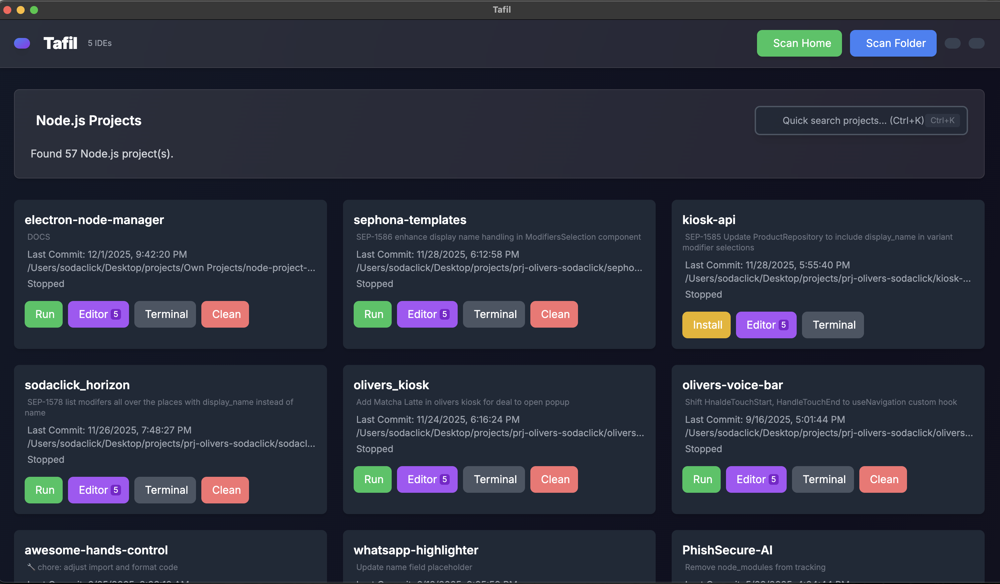

# 🚀 Tafil — Universal Project Manager for Developers


**Tafil** is a powerful, modern, and beautiful desktop application to manage all your Node.js projects in one place. Scan your directories, detect frameworks, run scripts, manage dependencies, and open projects in your favorite IDEs or terminals with a single click.

## ✨ Features

### 🔍 **Smart Project Scanning**
*   **Auto-Scan:** Instantly find all Node.js projects in your Home directory.
*   **Custom Folders:** Select any specific folder to scan deeply.
*   **Framework Detection:** Automatically identifies Vite, Next.js, React, Vue, Angular, Express, and more.
*   **Git Integration:** Shows current branch, last commit time, and status.

### 🛠 **Project Management**
*   **One-Click Run:** Start `dev` or `start` scripts instantly.
*   **Port Management:** Auto-detects used ports, handles conflicts, and suggests alternatives (supports custom ports).
*   **Dependency Control:** One-click `npm install` or delete `node_modules` to free up space.
*   **Live Logs:** View real-time `stdout` and `stderr` logs for running projects.

### 🖥 **Developer Experience**
*   **IDE Integration:** Auto-detects installed editors (VS Code, WebStorm, Cursor, Sublime, etc.) and opens projects directly.
*   **Terminal Support:** Opens projects in your favorite terminal (iTerm, Hyper, Warp, Kitty, PowerShell, etc.).
*   **Quick Search:** Instant search by project name, path, or git branch (Ctrl+K).
*   **Dark/Light Mode:** Beautiful UI with toggleable themes.

### ⚙️ **Customizable Settings**
*   Set your **Default IDE** to skip selection prompts.
*   Set your **Default Terminal** for a seamless workflow.
*   Preferences persist across sessions.

---

## 📥 Download & Install

### Pre-built Releases

Download the latest version for your platform from [**GitHub Releases**](https://github.com/Toseef-Ahmad/Tafil/releases):

| Platform | Download | Notes |
|----------|----------|-------|
| **macOS** | `Tafil-x.x.x-mac-arm64.dmg` (Apple Silicon) <br> `Tafil-x.x.x-mac-x64.dmg` (Intel) | See [macOS installation](#macos-installation) |
| **Windows** | `Tafil-x.x.x-win-x64.exe` (Installer) <br> `Tafil-x.x.x-portable.exe` (Portable) | See [Windows installation](#windows-installation) |
| **Linux** | `Tafil-x.x.x.AppImage` <br> `Tafil-x.x.x-amd64.deb` <br> `Tafil-x.x.x-x86_64.rpm` | See [Linux installation](#linux-installation) |

---

### 🍎 macOS Installation

1. Download the `.dmg` file for your Mac (arm64 for M1/M2/M3, x64 for Intel)
2. Open the `.dmg` and drag **Tafil** to Applications
3. **First launch:** Right-click the app → Click **Open** → Click **Open** again

> ⚠️ **Note:** Since the app is not signed with an Apple Developer certificate, macOS will show a warning. This is normal for open-source apps. You only need to do this once.

**Alternative:** Run in Terminal:
```bash
xattr -cr /Applications/Tafil.app
```

---

### 🪟 Windows Installation

1. Download the `.exe` installer or portable version
2. Run the installer (or just run the portable `.exe`)
3. **First launch:** If SmartScreen appears:
   - Click "**More info**"
   - Click "**Run anyway**"

> ⚠️ **Note:** Windows SmartScreen shows a warning because the app isn't signed with a paid certificate. This is normal for open-source apps and is safe to bypass.

---

### 🐧 Linux Installation

**AppImage (Universal):**
```bash
chmod +x Tafil-*.AppImage
./Tafil-*.AppImage
```

**Debian/Ubuntu (.deb):**
```bash
sudo dpkg -i Tafil-*-amd64.deb
```

**Fedora/RHEL (.rpm):**
```bash
sudo rpm -i Tafil-*-x86_64.rpm
```

---

## 🛠 Build from Source

### Prerequisites
*   Node.js (v18 or higher)
*   npm or yarn

### Development Setup

1.  **Clone the repository**
    ```bash
    git clone https://github.com/Toseef-Ahmad/Tafil.git
    cd Tafil
    ```

2.  **Install dependencies**
    ```bash
    npm install
    ```

3.  **Run in Development Mode**
    ```bash
    npm run dev
    ```

### Build for Production

```bash
# For macOS (DMG + ZIP)
npm run build:mac

# For macOS Universal (Intel + Apple Silicon)
npm run build:mac-universal

# For Windows (NSIS Installer + Portable)
npm run build:win

# For Linux (AppImage, DEB, RPM)
npm run build:linux

# For all platforms
npm run build:all
```

Build outputs are saved to the `release/` folder.

---

## 📸 Screenshots

### Project Dashboard


*Manage all your Node.js projects in one beautiful interface. Run projects, open in your favorite IDE, launch terminals, and clean up node_modules with a single click.*

---

## 🛠 Tech Stack

*   **Electron:** Desktop runtime environment.
*   **Node.js:** Backend logic and file system operations.
*   **TailwindCSS:** Modern, utility-first styling.
*   **FontAwesome:** Beautiful icons.
*   **Shell/Child Process:** Advanced process management.

---

## 🤝 Contributing

Contributions are what make the open-source community such an amazing place to learn, inspire, and create. Any contributions you make are **greatly appreciated**.

1.  Fork the Project
2.  Create your Feature Branch (`git checkout -b feature/AmazingFeature`)
3.  Commit your Changes (`git commit -m 'Add some AmazingFeature'`)
4.  Push to the Branch (`git push origin feature/AmazingFeature`)
5.  Open a Pull Request

---

## 📝 License

Distributed under the MIT License. See `LICENSE` for more information.

---

## 📬 Contact

**Touseef Ahmad** - [ahmadtouseef946@gmail.com](mailto:ahmadtouseef946@gmail.com)

Project Link: [https://github.com/Toseef-Ahmad/Tafil](https://github.com/Toseef-Ahmad/Tafil)
