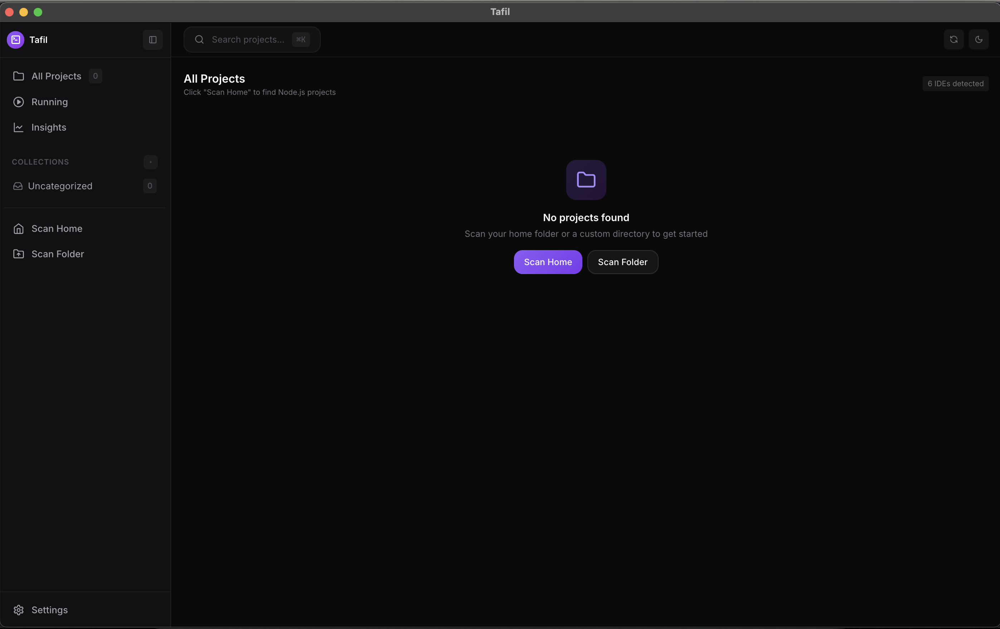
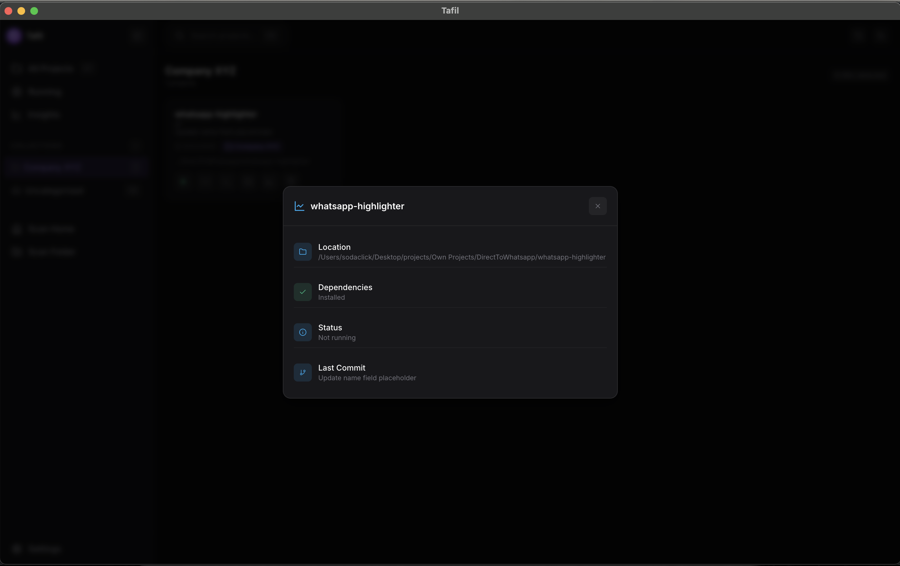

# 🚀 Tafil — Modern Project Manager for Node.js Developers


**Tafil** is a beautiful, modern desktop application inspired by Linear, Raycast, and Vercel. Manage all your Node.js projects in one place with a premium developer experience. Scan directories, organize with collections, run scripts, manage dependencies, and launch projects in your favorite IDE — all with a sleek, minimalist interface.

---

## ✨ Features

### 🎨 **Modern UI Design**
- **Premium Dark Theme** inspired by Linear, Raycast, Arc Browser, and Warp Terminal
- **Notion-like Sidebar** with collections and quick navigation
- **Command Palette** (⌘K) for lightning-fast actions
- **Smooth Animations** and polished micro-interactions
- **Compact Cards** with intelligent spacing and typography

### 📁 **Collections System**
- **Create Custom Collections** to organize projects by client, framework, or priority
- **Add Projects to Multiple Collections** with one click
- **Smart Filtering** - instantly view projects by collection
- **Visual Badges** show which collections a project belongs to
- **Built-in Collections:** All Projects, Running, Uncategorized

### 🔍 **Smart Project Scanning**
- **Auto-Scan:** Find all Node.js projects in your Home directory instantly
- **Custom Folders:** Scan any specific directory
- **Framework Detection:** Automatically identifies React, Vite, Next.js, Vue, Angular, Express, Gatsby, Remix, and more
- **Git Integration:** Shows current branch, last commit message, and timestamp
- **Cached Results** for lightning-fast refresh

### 🛠 **Intelligent Project Management**
- **One-Click Run:** Start dev servers instantly with automatic port detection
- **Smart Port Management:** 
  - Auto-detects and resolves port conflicts
  - Handles CRA port prompts automatically
  - Shows real-time port status
- **Dependency Control:** 
  - One-click `npm install`
  - Remove `node_modules` to free space
  - Visual indicators for missing dependencies
- **Live Status Indicators:** Running badge with pulse animation

### 📊 **Project Insights**
- **Insights Panel** with project health overview
- **Per-Project Details:**
  - Dependencies status
  - Running status and port
  - Git information
  - Last commit details
- **System-wide Metrics:** Track all running projects and dependencies

### 🖥 **Developer Experience**
- **IDE Integration:** Auto-detects VS Code, Cursor, WebStorm, Sublime Text, IntelliJ, Atom, and more
- **Terminal Support:** Launch in iTerm, Hyper, Warp, Kitty, Alacritty, Terminal.app, PowerShell, Windows Terminal
- **Default Preferences:** Set your preferred IDE and terminal to skip selection prompts
- **Quick Open in Browser:** One click to open running projects
- **Live Notifications:** Toast notifications for all important events

### ⌨️ **Command Palette**
- Press **⌘K** (macOS) or **Ctrl+K** (Windows/Linux) to access:
  - Search all projects by name or path
  - Quick actions (Scan, Refresh, View switching)
  - Jump to collections
  - Open settings
  - Keyboard navigation (↑↓ + Enter)

### 🎯 **Running Projects Panel**
- Dedicated view for all active dev servers
- Shows port, framework, and status
- Quick stop/open actions
- Live count badge with pulse animation

### ⚙️ **Customizable Settings**
- Set **Default IDE** to skip selection prompts
- Set **Default Terminal** for seamless workflow
- **Dark/Light Mode** toggle (coming soon)
- All preferences persist across sessions

---

## 📸 Screenshots

### Empty State


*Clean, inviting interface guides you to scan your projects*

### Project Dashboard


*Manage all your Node.js projects in one beautiful interface with modern card design*

### Collections


*Organize projects into custom collections with visual badges*

### Project Insights


*Deep dive into project details with dependency status, git info, and health metrics*

---

## 📥 Download & Install

### Pre-built Releases

Download the latest version for your platform from [**GitHub Releases**](https://github.com/Toseef-Ahmad/Tafil/releases):

| Platform | Download | Notes |
|----------|----------|-------|
| **macOS** | `Tafil-x.x.x-mac-arm64.dmg` (Apple Silicon) <br> `Tafil-x.x.x-mac-x64.dmg` (Intel) | Universal build supports both architectures |
| **Windows** | `Tafil-x.x.x-win-x64.exe` (Installer) <br> `Tafil-x.x.x-portable.exe` (Portable) | NSIS installer or standalone |
| **Linux** | `Tafil-x.x.x.AppImage` <br> `Tafil-x.x.x-amd64.deb` <br> `Tafil-x.x.x-x86_64.rpm` | Choose your preferred format |

---

### 🍎 macOS Installation

1. Download the `.dmg` file for your Mac (arm64 for M1/M2/M3/M4, x64 for Intel)
2. Open the `.dmg` and drag **Tafil** to Applications
3. **First launch:** Right-click the app → Click **Open** → Click **Open** again

> ⚠️ **Note:** Since the app is not signed with an Apple Developer certificate ($99/year), macOS will show a warning. This is normal for open-source apps distributed via GitHub. You only need to do this once.

**Alternative:** Run in Terminal:
```bash
xattr -cr /Applications/Tafil.app
```

---

### 🪟 Windows Installation

1. Download the `.exe` installer or portable version
2. Run the installer (or just run the portable `.exe`)
3. **First launch:** If SmartScreen appears:
   - Click "**More info**"
   - Click "**Run anyway**"

> ⚠️ **Note:** Windows SmartScreen shows a warning because the app isn't signed with an EV certificate ($300-500/year). This is normal for open-source apps and is completely safe to bypass.

---

### 🐧 Linux Installation

**AppImage (Universal):**
```bash
chmod +x Tafil-*.AppImage
./Tafil-*.AppImage
```

**Debian/Ubuntu (.deb):**
```bash
sudo dpkg -i Tafil-*-amd64.deb
```

**Fedora/RHEL (.rpm):**
```bash
sudo rpm -i Tafil-*-x86_64.rpm
```

---

## 🛠 Build from Source

### Prerequisites
- Node.js (v18 or higher)
- npm or yarn

### Development Setup

1. **Clone the repository**
   ```bash
   git clone https://github.com/Toseef-Ahmad/Tafil.git
   cd Tafil
   ```

2. **Install dependencies**
   ```bash
   npm install
   ```

3. **Run in Development Mode**
   ```bash
   npm run dev
   ```
   
   This will start both the Electron app and Tailwind CSS watcher.

### Build for Production

```bash
# For macOS (DMG + ZIP)
npm run build:mac

# For Windows (NSIS Installer + Portable)
npm run build:win

# For Linux (AppImage, DEB, RPM)
npm run build:linux

# For all platforms
npm run build:all
```

Build outputs are saved to the `release/` folder.

### Code Signing (Optional)

For production distribution, you can sign your builds:

- **macOS:** Requires Apple Developer account ($99/year)
- **Windows:** Requires EV Code Signing Certificate ($300-500/year)
- **Linux:** No signing required

See `build/signing.md` for detailed instructions.

---

## ⌨️ Keyboard Shortcuts

| Shortcut | Action |
|----------|--------|
| `⌘K` / `Ctrl+K` | Open Command Palette |
| `⌘R` / `Ctrl+R` | Refresh Projects |
| `Esc` | Close modals/palette |
| `↑` `↓` | Navigate command results |
| `Enter` | Execute selected command |

---

## 🎯 Usage Guide

### Getting Started

1. **Launch Tafil** and click **"Scan Home"** to find all Node.js projects
2. **Create Collections** using the + button in the sidebar to organize projects
3. **Add projects to collections** by clicking the folder icon on any project card
4. **Run a project** by clicking the green play button
5. **Open in IDE** by clicking the code icon (set your default in Settings)
6. **View insights** by clicking the chart icon on any project

### Using the Command Palette

Press `⌘K` (or `Ctrl+K`) to:
- **Search projects** by name or path
- **Quick actions** like Scan, Refresh, Settings
- **Switch views** (All Projects, Running, Insights)
- **Navigate collections** instantly

### Managing Running Projects

- Click **"Running"** in the sidebar to see all active dev servers
- Each running project shows:
  - Framework badge (React, Vite, Next.js, etc.)
  - Port number
  - Quick actions to open in browser or stop
- Tafil handles port conflicts automatically

### Project Insights

Click the **chart icon** on any project to see:
- Dependencies status (installed/missing)
- Git information (branch, last commit)
- Running status and port
- Project location

---

## 🛠 Tech Stack

- **Electron 33.x:** Cross-platform desktop runtime
- **Node.js:** Backend logic and file system operations
- **Tailwind CSS 3.x:** Modern utility-first styling
- **Lucide Icons:** Beautiful, consistent SVG icons
- **Inter Font:** Premium typography
- **IPC Communication:** Secure main-renderer bridge
- **Child Process Management:** Advanced process handling

---

## 🎨 Design Inspiration

Tafil's design is inspired by the best modern developer tools:

- **Linear** - Clean layout and perfect spacing
- **Raycast** - Command palette and keyboard-first approach
- **Vercel Dashboard** - Typography and card design
- **Warp Terminal** - Speed-focused interface
- **Arc Browser** - Premium polish and animations
- **Notion** - Sidebar organization

---

## 🚀 Roadmap

- [ ] Multi-language support (Python, Ruby, Go, Rust projects)
- [ ] Remote project management via SSH
- [ ] Docker container integration
- [ ] Project templates and scaffolding
- [ ] Advanced git operations (branch switching, commit, push)
- [ ] Package update notifications
- [ ] Script favorites and custom commands
- [ ] Team collaboration features
- [ ] Light mode theme
- [ ] Plugin system for extensibility

---

## 🤝 Contributing

Contributions are what make the open-source community such an amazing place to learn, inspire, and create. Any contributions you make are **greatly appreciated**.

### How to Contribute

1. Fork the Project
2. Create your Feature Branch (`git checkout -b feature/AmazingFeature`)
3. Commit your Changes (`git commit -m 'Add some AmazingFeature'`)
4. Push to the Branch (`git push origin feature/AmazingFeature`)
5. Open a Pull Request

### Development Guidelines

- Follow the existing code style
- Test on multiple platforms when possible
- Update documentation for new features
- Add screenshots for UI changes

---

## 🐛 Known Issues

- **macOS:** First launch requires right-click → Open due to unsigned app
- **Windows:** SmartScreen warning appears due to unsigned executable
- **Linux:** Some distros may require additional permissions for file access

These are expected behaviors for unsigned open-source applications.

---

## 📝 License

Distributed under the MIT License. See `LICENSE` for more information.

---

## 📬 Contact

**Touseef Ahmad** - [ahmadtouseef946@gmail.com](mailto:ahmadtouseef946@gmail.com)

Project Link: [https://github.com/Toseef-Ahmad/Tafil](https://github.com/Toseef-Ahmad/Tafil)

---

## 💖 Acknowledgments

- Electron.js team for the amazing framework
- Tailwind CSS for the styling system
- All open-source contributors
- The developer community for feedback and support

---

## ⭐ Star History

If you find Tafil useful, please consider giving it a star on GitHub! It helps others discover the project.

[](https://star-history.com/#Toseef-Ahmad/Tafil&Date)
