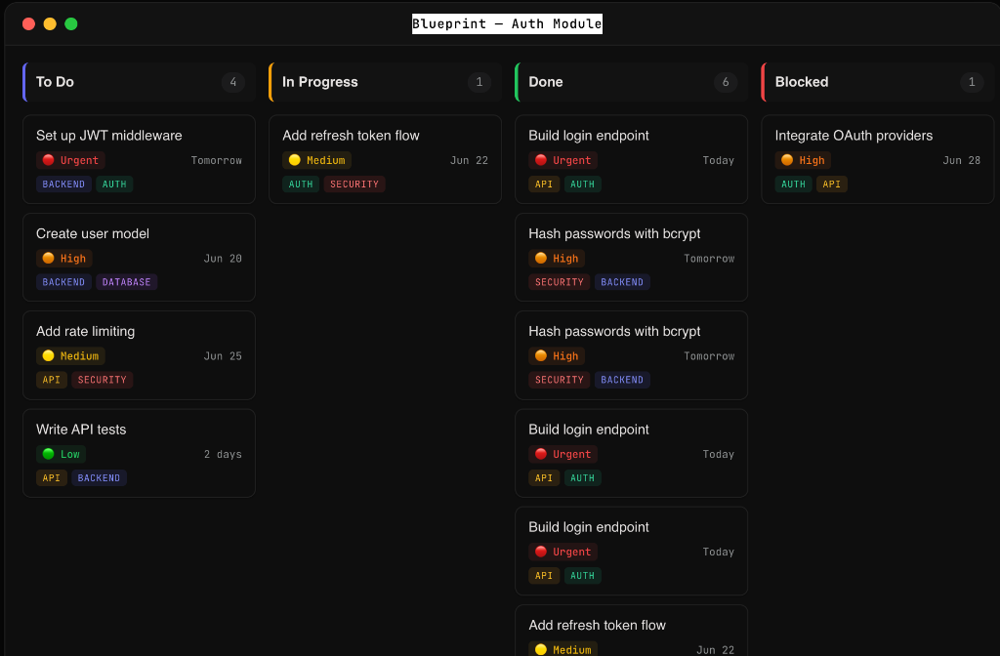

<div align="center">


# Tafil

### Your Project Operating System for the AI Era

Plan. Build. Export. — One blueprint for your entire project, instantly available to your AI editor.

[](https://github.com/Toseef-Ahmad/Tafil/releases)
[](https://github.com/Toseef-Ahmad/Tafil/releases)
[](https://app.tafil.app)
[](LICENSE)

[Website](https://tafil.app) · [Web App](https://app.tafil.app) · [Download](https://github.com/Toseef-Ahmad/Tafil/releases) · [Get Pro](https://tafil.gumroad.com/l/tafil-license)

**macOS** · **Linux** · **Windows** · **Web**

</div>

---

## 🧠 What is Tafil?

Tafil is **not another IDE**. It's the structured thinking layer between your mind and your AI editor.

Every project gets a **Blueprint** — a unified workspace with your goal, tasks, whiteboard, code scratchpad, and resource links — all in one split-pane view. Then export it all to **Cursor**, **Claude Code**, **Windsurf**, or any MCP-compatible editor in one click.

> **Stop copying context. Start building with context.**

### The 3 Problems Tafil Solves

| Problem | How Tafil Fixes It |
|---------|-------------------|
| **🧠 The Amnesia Loop** — AI editors forget context every session | Blueprints provide persistent `.tafil/` memory that your AI can always access |
| **🔀 The Thinking Gap** — Planning tools disconnected from code | Blueprint Modules bundle goal, tasks, canvas, code, and resources in one place |
| **💸 $531/year for Chaos** — Notion + Linear + Obsidian + Excalidraw + Slack | Tafil replaces all five for **$0/year** (Free) or **$29/year** (Pro) |

---

## 📸 Preview

<div align="center">


*Your project command center — everything at a glance*

</div>

---

## ✨ Features

### 🎯 Blueprints — Per-Project Planning
Every project gets a Blueprint with **5 integrated tabs** in split panes:

| Tab | What it does |
|-----|-------------|
| **Goal** | Rich text editor with `@mention` cross-referencing (tasks, headings, canvas, resources) |
| **Tasks** | Kanban board with drag-and-drop, priorities (low → critical), tags, and status tracking |
| **Canvas** | Excalidraw-powered infinite whiteboard with multiple canvas tabs per module |
| **Code** | Monaco editor scratchpad for notes, snippets, and prototypes |
| **Resources** | External link management — docs, articles, repos, videos |

Blueprints live in a `.tafil/` directory alongside your code. Your AI editor can read them natively.

### 🤖 AI Context Export + MCP Server

**55+ MCP tools** injectable into Cursor, Claude Code, or Windsurf:

```bash
# Start the MCP server
tafil --mcp

# Or use the CLI to export context
tafil restore my-project
```

| Category | Tools | Examples |
|----------|-------|---------|
| Projects | 8 | List, scan, detect editors, export context |
| Blueprints | 16 | CRUD, tasks, canvas, import/export, chat |
| DevStack | 2 | Framework detection, port management |
| Filesystem | 4 | Read files, search, list directories |
| SSH | 5 | Host management, config parsing, audit |
| Dependencies | 3 | Size analysis, install, clean |
| Cloud Sync | 12 | Full cloud CRUD, member management |
| Info | 4 | Version, license, system info |

**Read tools = Free. Write tools = Pro.**

### 👥 P2P Real-time Collaboration
- **Yjs CRDTs + WebRTC** — zero-server peer-to-peer sync
- Google Docs-style live cursors (~30fps)
- Real-time chat and presence indicators
- Role-Based Access Control: Owner, Editor, Viewer
- Auto-reconnect with exponential backoff
- Cross-platform: Desktop ↔ Web

### 🤖 Built-in AI Assistant
- **Multi-provider**: Ollama (local), OpenAI, Anthropic
- `@project` mentions inject deep project context automatically
- Streaming responses with markdown rendering
- Tool calling: read files, search, list dirs, run commands
- Coding Agent Mode for aggressive codebase exploration
- Voice input + TTS
- Save custom prompts and context presets

### 📦 Project Scanner & Manager
- Auto-detects **30+ frameworks** (Next.js, React, Vue, Express, Laravel, Django, Rails, Flutter, Rust, Go...)
- **30+ languages** via file extensions
- Grid/list view, search, sort, favorites, categories
- Open in Cursor, VS Code, Zed, or Finder
- Dependency size display and bulk cleanup

### 🔧 Tafil CLI

```
Usage: tafil <command> [options]

Commands:
  tafil list                  List all tracked projects
  tafil status <project>      Show project details + dev stack
  tafil restore <project>     Export full AI context pack
  tafil scan [path]           Scan directory for projects
  tafil blueprint <action>    Blueprint CRUD (list/read/init/export)
  tafil mcp                   Start MCP server (stdio)
  tafil stack                 Show dev stack mappings
  tafil open <project> [ed]   Open in Cursor/VS Code/Zed
```

### 🔐 SSH Connection Manager
- Saved connection profiles
- SSH config parsing
- Audit logging
- Cloud sync of SSH hosts (Pro)

### 🎨 16 Editor Themes
Tokyo Night · Dracula · Nord · Catppuccin · Synthwave '84 · Monokai Pro · Ayu · Gruvbox · One Dark · Solarized · GitHub Dark · Rosé Pine · Night Owl · Panda · Palenight · Default Dark

### 📊 Activity & Engagement
- GitHub-style contribution heatmap
- Day streaks and smart nudges
- Blueprint stage lifecycle: 💡 Spark → 📐 Structure → 🔨 Execute → 📊 Reflect
- Weekly review stats
- Stage transition celebrations

### ⌨️ Power User Features
- **Command Palette** (⌘K) — Fuzzy search across all commands
- **Keyboard Engine** — Cross-platform shortcuts, rebindable, Monaco-aware
- **Blueprint Hierarchy** — Child blueprints with progress rollup
- **System Tray** — Close-to-tray, show/hide, quit from tray
- **Auto-Updater** — Seamless updates via electron-updater

---

## 🚀 Quick Start

### Download

| Platform | Architecture | Download |
|----------|-------------|----------|
| **macOS** | Universal (Apple Silicon + Intel) | [Tafil.dmg](https://github.com/Toseef-Ahmad/Tafil/releases/latest) |
| **Linux** | x64 | [Tafil.AppImage](https://github.com/Toseef-Ahmad/Tafil/releases/latest) / [.deb](https://github.com/Toseef-Ahmad/Tafil/releases/latest) |
| **Windows** | x64 | [Tafil-Setup.exe](https://github.com/Toseef-Ahmad/Tafil/releases/latest) |
| **Web** | All browsers | [app.tafil.app](https://app.tafil.app) |

### Or use the web app instantly

👉 **[app.tafil.app](https://app.tafil.app)** — no download required

### Setup MCP for Cursor / Claude Code

Add to your editor's MCP config:

```json
{
  "mcpServers": {
    "tafil": {
      "command": "/Applications/Tafil.app/Contents/MacOS/Tafil",
      "args": ["--mcp"]
    }
  }
}
```

Or run manually:
```bash
tafil --mcp
```

---

## 🏗️ Tech Stack

| Layer | Technology |
|-------|-----------|
| Shell | Electron 34 |
| UI | React 19 + TypeScript 5.7 |
| State | Zustand 5 |
| Build | electron-vite 2 + Vite 5 |
| Canvas | Excalidraw 0.18 |
| Code Editor | Monaco Editor 0.55 |
| Terminal | xterm.js 6.0 + node-pty |
| Collaboration | Yjs CRDTs + y-webrtc |
| AI/MCP | @modelcontextprotocol/sdk 1.29 |
| SSH | ssh2 |
| Animations | Framer Motion 12 |
| Command Palette | cmdk |
| Search | Fuse.js (fuzzy) |
| Auto-Update | electron-updater |
| Schema | Zod 4.4 |
| Web App | Next.js 16.2 + React 19 + Zustand 5 |

---

## 💰 Pricing

| | **Free** | **Pro** |
|---|---|---|
| **Price** | **$0/forever** | **$29/year** |
| Modules/project | 5 | Unlimited |
| Tasks/module | 25 | Unlimited |
| Canvas tabs | 1 | Unlimited |
| AI suggestions/month | 10 | Unlimited |
| P2P Collaboration | ✅ | ✅ |
| Real-time chat & cursors | ✅ | ✅ |
| 16 editor themes | ✅ | ✅ |
| Marketplace (browse) | ✅ | ✅ |
| Cloud sync (web ↔ desktop) | ❌ | ✅ |
| MCP Server (write tools) | ❌ | ✅ |
| AI Context Export | ❌ | ✅ |
| SSH config sync | ❌ | ✅ |
| Publish to Marketplace | ❌ | ✅ |
| Agent sessions | 1 | Unlimited |
| Priority support | ❌ | ✅ |

👉 [**Get Pro — $29/year**](https://tafil.gumroad.com/l/tafil-license)

---

## 📁 Project Structure

```
tafil-desktop/
├── src/
│   ├── main/                    # Electron main process
│   │   ├── index.ts             # App entry, window management
│   │   ├── cli/index.ts         # CLI binary (tafil command)
│   │   ├── mcp/                 # MCP server (55+ tools)
│   │   │   ├── tafil-mcp-server.ts
│   │   │   └── tools/           # 12 tool modules
│   │   ├── ipc/                 # IPC handlers
│   │   └── services/            # Business logic
│   │       ├── BlueprintManager.ts
│   │       ├── ProjectScanner.ts
│   │       ├── CloudSyncManager.ts
│   │       ├── SSHManager.ts
│   │       ├── LicenseManager.ts
│   │       └── ...
│   ├── preload/                 # Context bridge
│   └── renderer/                # React UI
│       ├── stores/              # 11 Zustand stores
│       ├── views/               # 10 app views
│       └── components/
├── resources/                   # Icons, splash screen
├── electron.vite.config.ts
└── package.json
```

---

## 🌐 Ecosystem

| Component | URL | Purpose |
|-----------|-----|---------|
| Landing Page | [tafil.app](https://tafil.app) | Marketing & downloads |
| Web App | [app.tafil.app](https://app.tafil.app) | Browser-based Tafil |
| License API | [api.tafil.app](https://api.tafil.app) | License validation, cloud sync, marketplace |
| Gumroad | [tafil.gumroad.com](https://tafil.gumroad.com/l/tafil-license) | Pro license purchase |
| GitHub Releases | [Releases](https://github.com/Toseef-Ahmad/Tafil/releases) | Desktop downloads |

---

## 🛡️ Privacy & Trust

- **🔒 100% Offline** — All data stored locally in `.tafil/` directories. Works without internet.
- **📡 Zero Telemetry** — No tracking, no analytics, no phone-home. Ever.
- **❤️ Indie Built** — Solo developer, no VC funding, no growth hacking.
- **🚫 No Dark Patterns** — No upsell popups, no forced upgrades, no data lock-in.
- **📄 MIT License** — Open and transparent.

---

## 🤝 Support

- **Website**: [tafil.app](https://tafil.app)
- **Email**: [ahmadtouseef946@gmail.com](mailto:ahmadtouseef946@gmail.com)
- **Issues**: [GitHub Issues](https://github.com/Toseef-Ahmad/Tafil/issues)

---

<div align="center">

**Built with ❤️ by [Toseef Ahmad](https://github.com/Toseef-Ahmad)**

*Stop juggling tools. Start shipping with one blueprint.*

</div>
