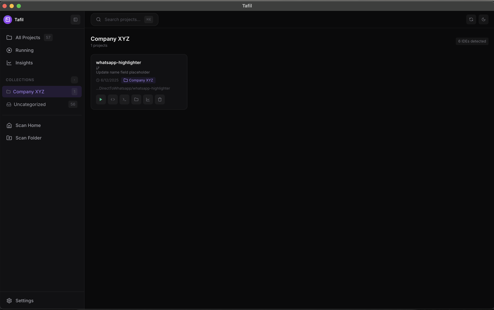
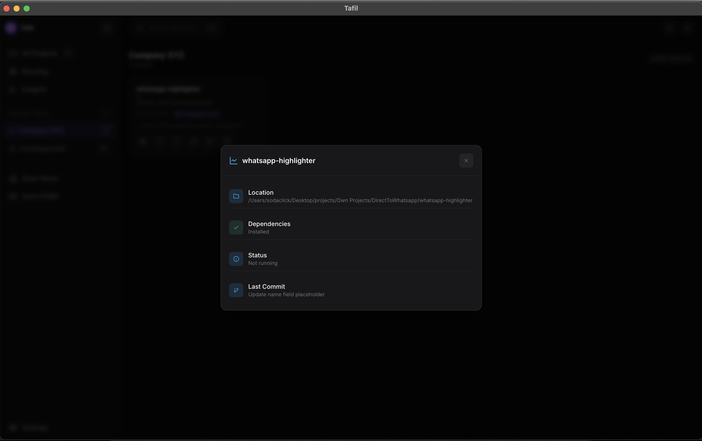
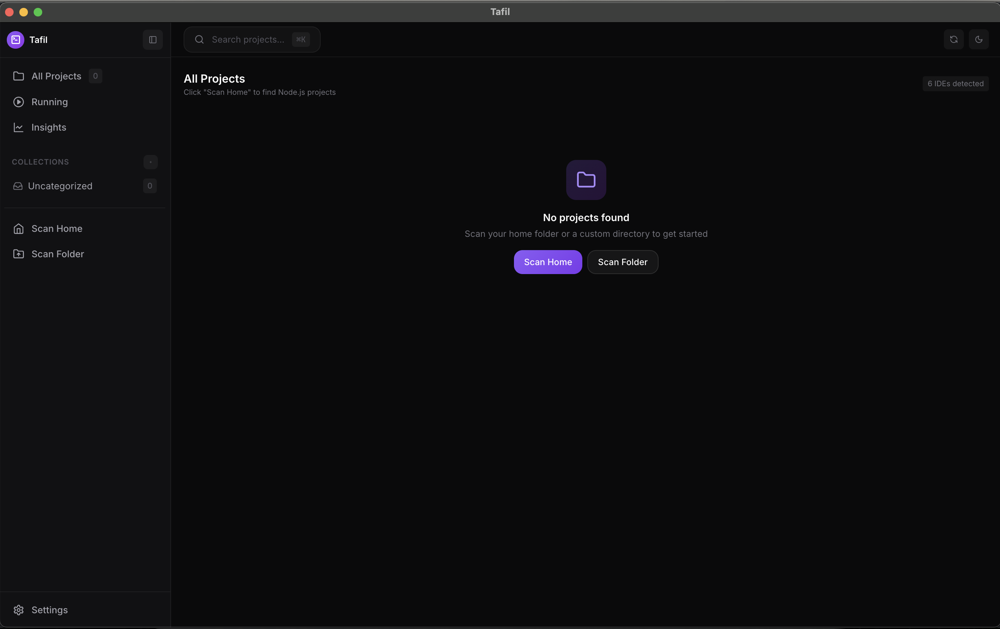

<div align="center">


# TAFIL

**The project command center for developers**

Manage projects, write documentation, plan features, and experiment with code — all in one desktop app that works alongside your IDE.

[](https://github.com/Toseef-Ahmad/Tafil/releases)

[](https://github.com/Toseef-Ahmad/Tafil/releases)

[Website](https://tafil.app) • [Download](https://github.com/Toseef-Ahmad/Tafil/releases) • [Documentation](https://tafil.app) • [Support](mailto:ahmadtouseef946@gmail.com)

</div>

---

## 📸 Preview

<div align="center">


*Manage all your projects from one beautiful interface*

</div>

---

## ✨ Why TAFIL?

TAFIL is your second brain for development. It's not an IDE — it works **alongside** your favorite code editor. Think of it as mission control for all your projects.

- **📁 Project Management** — Scan folders, auto-detect frameworks, launch servers with one click
- **⚡ Code Playground** — Test JavaScript snippets without creating new projects
- **📐 Visual Blueprints** — Plan architecture with Kanban boards and module diagrams
- **📝 Markdown Notes** — Write documentation with full Markdown support and wiki-style linking
- **🖥️ SSH Integration** — Connect to remote servers and manage multiple connections
- **🔒 100% Offline** — All data stored locally. Works without internet. Your privacy matters.

---

## 🚀 Quick Start

### Download

Get TAFIL for your platform:

- **macOS** (Intel & Apple Silicon) — [Download .dmg](https://github.com/Toseef-Ahmad/Tafil/releases/download/v1.0.0/Tafil-1.0.0-darwin-universal.dmg)
- **Windows** 10/11 — [Download .exe](https://github.com/Toseef-Ahmad/Tafil/releases/download/v1.0.0/Tafil-1.0.0-portable.exe)
- **Linux** (x64 / ARM64) — [Download x64](https://github.com/Toseef-Ahmad/Tafil/releases/download/v1.0.0/Tafil-1.0.0-x86_64.AppImage) | [Download ARM64](https://github.com/Toseef-Ahmad/Tafil/releases/download/v1.0.0/Tafil-1.0.0-arm64.AppImage)

### Installation

**macOS:**
```bash
# Download the .dmg file
# Drag TAFIL to Applications folder
# If you see "unidentified developer", right-click → Open
```

**Windows:**
```bash
# Download the .exe installer
# Run the installer
# Launch TAFIL from Start Menu
```

**Linux:**
```bash
# Download the .AppImage file
chmod +x Tafil-1.0.0-x86_64.AppImage
./Tafil-1.0.0-x86_64.AppImage
```

---

## 🎯 Key Features

<table>
<tr>
<td width="50%">

### 📁 Project Management
Scan your machine for projects, organize them into collections, and launch dev servers with one click.

**Auto-detects:**
- Next.js, React, Vue, Angular
- Express, Nest.js, Fastify
- Python, Django, Flask
- And many more...

</td>
<td width="50%">

### ⚡ Code Playground
Test JavaScript/TypeScript snippets instantly. No need to create throwaway projects.

**Perfect for:**
- Testing APIs
- Experimenting with libraries
- Prototyping ideas
- Learning new concepts

</td>
</tr>
<tr>
<td width="50%">

### 📐 Visual Blueprints
Plan your architecture before you code.

**Features:**
- Create modules and features
- Track progress with Kanban boards
- Document decisions
- Link notes together

</td>
<td width="50%">

### 📝 Markdown Notes
Full-featured note-taking system.

**Includes:**
- Live preview
- Syntax highlighting
- Wiki-style linking
- Export to PDF

</td>
</tr>
<tr>
<td width="50%">

### 🖥️ SSH Integration (Pro)
Connect to remote servers seamlessly.

**Capabilities:**
- Save multiple connections
- Quick access to servers
- Terminal integration
- Secure credentials

</td>
<td width="50%">

### 🔒 100% Offline
Your data, your machine.

**Privacy-first:**
- All data stored locally
- Works without internet
- No tracking or telemetry
- Full control over your data

</td>
</tr>
</table>

---

## 🖼️ More Screenshots

<details>
<summary><b>Click to view more screenshots</b></summary>

<br/>

### Collections View


### Project Insights


### Empty State


</details>

---

## 💎 Free vs Pro

### Free (Forever)
- ✅ Unlimited projects
- ✅ Basic playground
- ✅ Markdown notes
- ✅ Kanban boards
- ✅ Offline mode

### Pro ($49 one-time)
- ✅ Everything in Free
- ✅ Advanced playground with npm packages
- ✅ SSH integration
- ✅ Excalidraw canvas
- ✅ Wiki-style note linking
- ✅ Unlimited modules
- ✅ 3 device activations
- ✅ Priority support

[Get Pro License →](https://tafil.gumroad.com/l/tafil-license)

---

## 🛠️ Tech Stack

<div align="center">


</div>

**Core Technologies:**
- **Electron** — Cross-platform desktop framework
- **React** — UI framework with hooks
- **Vite** — Lightning-fast build tool
- **Monaco Editor** — VSCode's powerful editor
- **Excalidraw** — Beautiful drawing canvas
- **Tailwind CSS** — Utility-first styling

---

## 📖 Documentation

Visit [tafil.app](https://tafil.app) for full documentation including:
- Getting started guide
- Feature tutorials
- Keyboard shortcuts
- FAQs
- Troubleshooting

---

## 🤝 Contributing

We welcome contributions! Here's how you can help:

1. **Report bugs** — [Open an issue](https://github.com/Toseef-Ahmad/Tafil/issues)
2. **Suggest features** — [Start a discussion](https://github.com/Toseef-Ahmad/Tafil/discussions)
3. **Improve docs** — Submit a PR with documentation improvements
4. **Spread the word** — Star the repo, share with friends

---

## 📝 License

TAFIL is licensed under the **MIT License**. See [LICENSE](./LICENSE) for details.

The free version includes all core features. The Pro version unlocks advanced features and supports continued development.

---

## 💬 Support

- **Email:** [tafil.help@gmail.com](mailto:tafil.help@gmail.com)
- **Issues:** [GitHub Issues](https://github.com/Toseef-Ahmad/Tafil/issues)
- **Website:** [tafil.app](https://tafil.app)

---

## 🌟 Acknowledgments

Built with ❤️ by [Touseef Ahmad](https://github.com/Toseef-Ahmad)

Special thanks to all the open-source projects that made TAFIL possible.

---

<div align="center">

**[⬇️ Download TAFIL](https://github.com/Toseef-Ahmad/Tafil/releases)** • **[🌐 Visit Website](https://tafil.app)** • **[⭐ Star on GitHub](https://github.com/Toseef-Ahmad/Tafil)**

Made with passion for developers who love to build.

</div>
